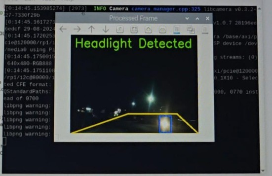
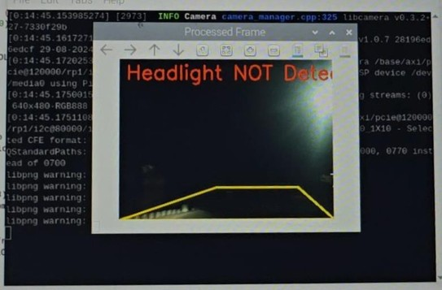
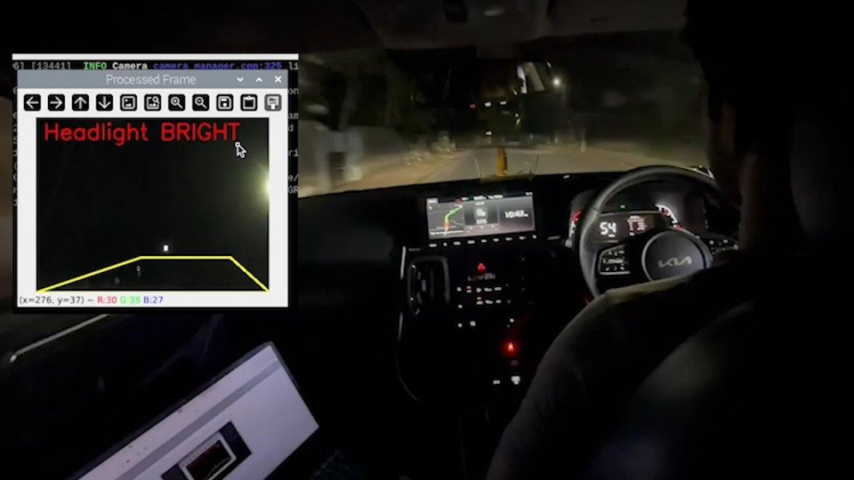

# Advanced Driver Assistance System (ADAS) [web:1][web:17]

Comprehensive computer vision-based ADAS prototype implementing lane detection, vehicle detection, and driver safety warnings using OpenCV and classical image processing techniques.[web:9][web:17]

> 📊 **Project Presentation**: [Presentation.pdf](./Presentation.pdf)

---

## 🚀 Features

- **Lane Departure Warning (LDW)** - Detects lane markings and alerts on unintended lane drift
- **Real-time processing** - Optimized for live camera feeds
- **Visual overlays** - Clear bounding boxes and warning annotations
- **Configurable thresholds** - Adjustable sensitivity for different conditions

---

## 📱 Demo

**Automatic Headlight Dimming System** - Detects oncoming headlights at night using OpenCV contour detection and brightness thresholding.

### Night Driving - No Oncoming Traffic
 [attached_image:3]

**Console Output**: `Headlight NOT Detected` - Headlights remain **BRIGHT** for optimal visibility.

### Oncoming Vehicle Detected
 [attached_image:2]

**Console Output**: `Headlight Detected` - System automatically **DIMS** headlights to avoid blinding other drivers.

### Real-World Dashboard Demo
 [attached_image:1]

**Live Processing**: System running on laptop during actual night driving, processing camera feed in real-time.

---

### 🧠 How It Works (3-Step Pipeline)

1. **Road ROI Masking** → Focus on driving area, ignore dashboard/hood [attached_image:2]
2. **Brightness Thresholding** → Detect bright headlight regions (> threshold) [attached_image:2]
3. **Contour Detection** → Identify and validate oncoming vehicle headlights [attached_image:1][attached_image:2]

## 🏗️ System Architecture

**Complete hardware + software ADAS system** with automatic headlight control and multi-sensor integration.

 [attached_image:1]

### Hardware Components
| Module | Purpose | Interface |
|--------|---------|-----------|
| **Raspberry Pi** | CV processing + control logic | GPIO/I2C |
| **Camera** | Night driving feed | USB/MIPI |
| **Headlight Relay** | Auto dim/bright | GPIO |
| **Rain Sensor** | Weather detection | GPIO |
| **Accelerometer** | Vehicle dynamics | I2C |
| **GSM/WiFi + GPS** | Location & remote alerts | UART/USB |

### Processing Pipeline

1. Capture frame from camera.
2. Apply ROI masking and brightness thresholding.
3. Find contours corresponding to oncoming headlights.
4. Decide whether to dim or brighten the headlights.
5. Trigger relay and update on‑screen status.

---

## 🛠️ Tech Stack

| Component   | Technology            |
|------------|-----------------------|
| Computer   | Raspberry Pi          |
| Vision     | OpenCV (Python)       |
| Logic      | Python 3              |
| Control    | GPIO + Relay Module   |

---

## 🚀 Quick Start

### Prerequisites

- Raspberry Pi with Python 3  
- OpenCV and NumPy installed  
- Camera connected and working  

---

## 🎯 Results

- Detects oncoming vehicle headlights in real time from the front camera.
- Automatically toggles between **BRIGHT** and **DIM** using a relay to control the headlamps.
- Verified at night on real roads using a Raspberry Pi mounted inside the car.

---

## 🔍 How It Works

1. **Headlight Detection**  
   - Convert frame to grayscale, apply ROI mask.  
   - Use brightness thresholding to isolate very bright pixels.  
   - Find contours and select candidates in the expected headlight region.

2. **Decision & Control**  
   - If a valid contour is detected, switch headlights to **DIM**.  
   - If no oncoming headlight is present, keep or return to **BRIGHT**.  
   - Status is shown on the processed frame window and used to drive the relay.

---

## ⚠️ Limitations & Future Work

- Optimized for night driving; not designed for daytime or heavy glare.  
- Assumes a fixed camera position and single forward‑facing view.  

Possible improvements:

- Better robustness to rain/fog using additional sensors.  
- Tuning thresholds for different cameras and vehicles.  
- Logging and remote monitoring via GSM/Wi‑Fi and GPS.

---

## 👥 Author

**Lijaz S**

---

## 📄 License

MIT License – see `LICENSE` for details.

*⭐ Star this repo if you found it useful!*
